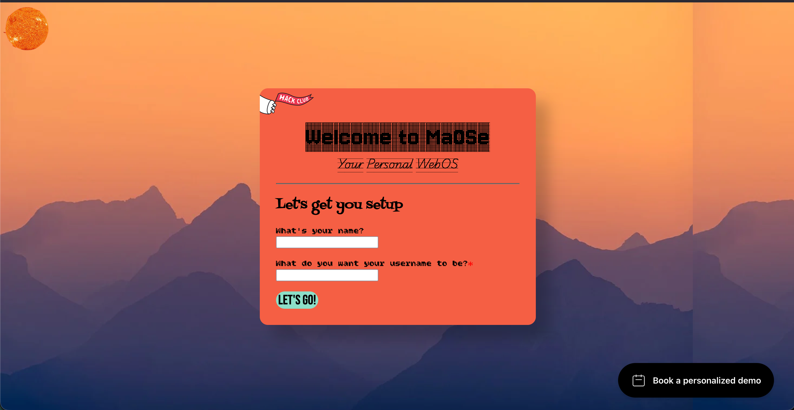
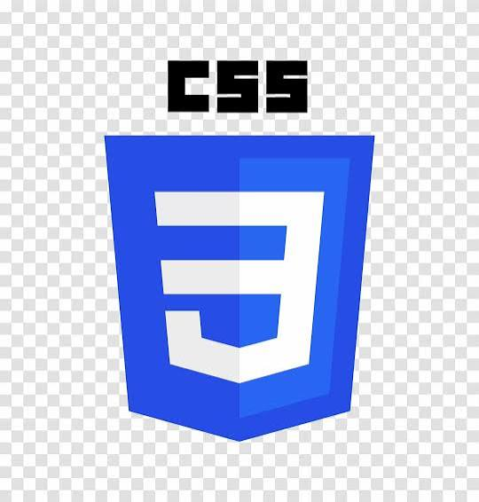
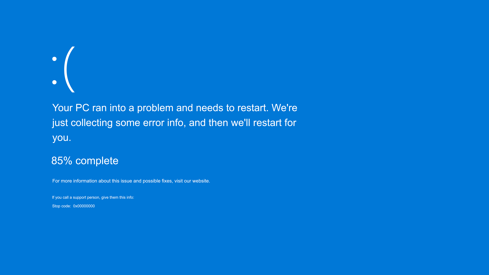

# maose
MaOSe is a personal web-os where you can make notes (which you can't export or edit after once unless you know the funfact)



## Built with 



## Getting Started
Make sure you have VS Code Installed with the [live server](https://marketplace.visualstudio.com/items?itemName=ritwickdey.LiveServer) extension installed.


## Forking
To fork, first clone this repo, then open this repo folder in VSCode, and simply hit "Go Live" in the bottom right corner of the window. (Copy this command in your terminal)
```
git clone https://github.com/harshilarora250/maose
cd maose #now follow the instructions above
```

## Usage
You can use this as a fun little party trick. Trick your friends, if you have friends ig.

## AI Usage
AI was used in this project for the stupidest things and **bugs**. You can see where I used AI with the lookout recording as well. I also used AI to learn about the motion.dev animations and stuff to refine maose even more



## Time Recording (HC)
I used [lookout](https://lookout.hackclub.com/) because my Waka/Hacka time didn't work properly and under-record time, and I couldn't record hours outside of VS Code

## Contribution
This project was developed by [Harshil Arora](elipseday-nine.vercel.app/#contact)